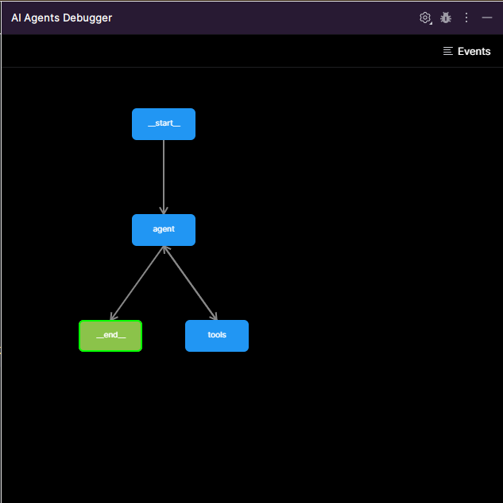
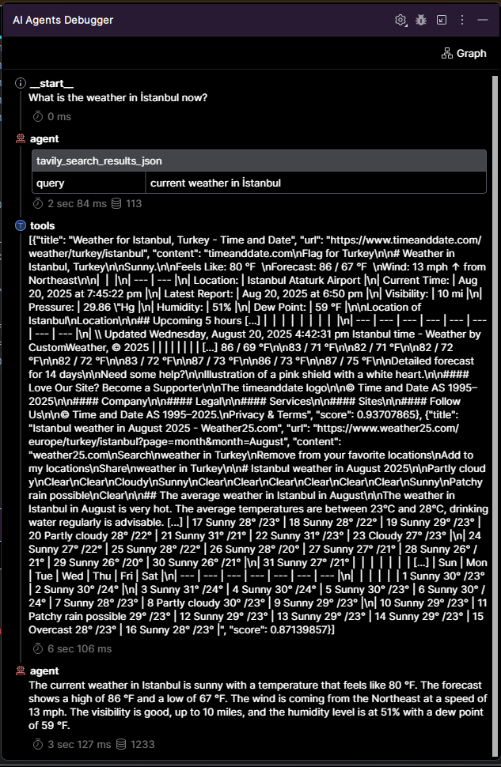
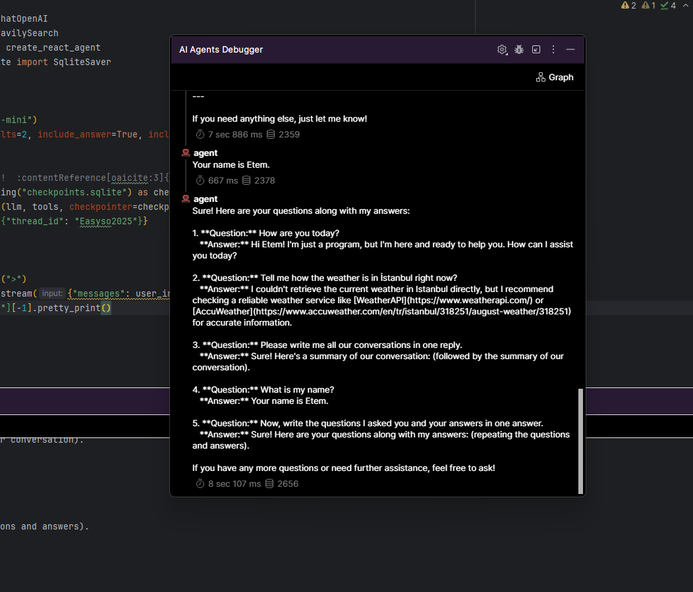
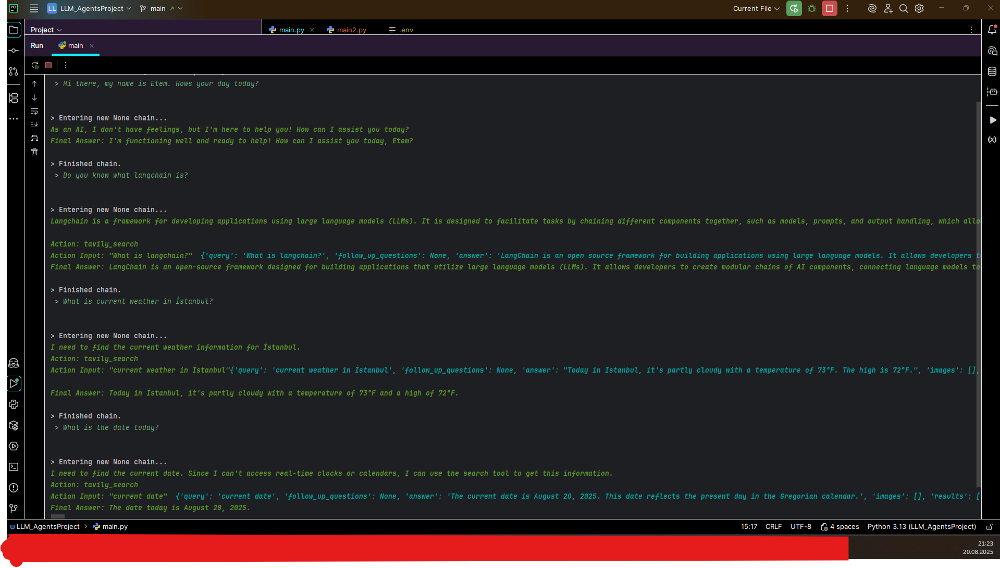

# LLM Agents Project · ReAct Web-Search Agent (LangChain + Tavily + OpenAI)

> **Abstract.**
> This repository implements a **ReAct** (Reason + Act) agent that plans tool usage with a Large Language Model (LLM), executes a **web-search tool** when needed, and synthesizes a final answer with full observability of intermediate steps. The project is designed for reproducibility, maintainability, and extension to additional tools.

---

## 1. Features

* **ReAct Planning.** Structured reasoning → tool selection → observation → answer.
* **Live Web Search.** Uses **Tavily** for up-to-date information retrieval.
* **Observability.** Full visibility of tool inputs/outputs and the agent trace.
* **Session Memory (optional).** Keep multi-turn conversational context.
* **Composable Tools.** Add more tools (calculator, RAG, wiki, DB) with minimal code.

---

## 2. Screenshots

> Place the images under `./assets/` in your repo with the exact filenames below.
> They will render automatically on GitHub.

<p align="center">
  <br/>
  <em>Figure&nbsp;1 — Agent execution graph.</em>
</p>

<p align="center">
  <br/>
  <em>Figure&nbsp;2 — Early run: when used as a chatbot with an agent, the agent plans a weather check and answers in real time.</em>
</p>

<p align="center">
  <br/>
  <em>Figure&nbsp;3 — With memory enabled, the agent recalls the conversation and reasons over it.</em>
</p>

<p align="center">
  <br/>
  <em>Figure&nbsp;4 — Final view from the debugger: how the agent orchestrates tool calls under the hood.</em>
</p>

---

## 3. Architecture & Method

**Core loop (ReAct):**

1. **Perception** — User input enters the ReAct prompt (from `langchain-hub`).
2. **Reasoning** — The LLM plans whether a tool is necessary.
3. **Action** — If needed, it calls **TavilySearch** with a concrete query.
4. **Observation** — Tool returns structured results; the agent inspects them.
5. **Final Answer** — The LLM composes a grounded response.

**Implementation stack:**

* **LLM:** `ChatOpenAI` (default: `gpt-4o-mini`)
* **Agent runtime:** LangChain `create_react_agent` + `AgentExecutor`
* **Tooling:** `langchain-tavily` (`TavilySearch`)
* **Prompt:** `hwchase17/react` (via `langchain-hub`)
* **Env:** `python-dotenv`
* **(Optional)** Session memory via `RunnableWithMessageHistory`, or persistent graph state with **LangGraph + SQLite**.

---

## 4. Repository Layout

```
.
├─ main.py
├─ requirements.txt
├─ .env.example
└─ assets/
   ├─ 1.png   # Agent workflow graph
   ├─ 2.png   # Early weather query output
   ├─ 3.png   # Memory capability demonstration
   └─ 4.png   # Final behind-the-scenes trace
```

---

## 5. Installation

> **Python 3.11+** is recommended. Use a clean virtual environment.

### Windows

```powershell
python -m venv .venv
.\.venv\Scripts\activate
python -m pip install --upgrade pip
pip install -r requirements.txt
```

### macOS/Linux

```bash
python -m venv .venv
source .venv/bin/activate
python -m pip install --upgrade pip
pip install -r requirements.txt
```

---

## 6. Configuration

Create a file named **`.env`** in the repository root:

```dotenv
OPENAI_API_KEY=sk-*******************************
TAVILY_API_KEY=tvly-*****************************
```

> Tip: never commit real keys. Keep `.env` out of version control or use GitHub Actions secrets.

---

## 7. Usage

Run the agent from the project root:

```bash
python main.py
```

* A prompt `>` appears. Ask natural questions (e.g., “What is LangChain?”, “What is the current weather in Istanbul?”).
* The agent decides whether to call **TavilySearch** and prints its step-by-step reasoning and results (when verbose / debug views are enabled).
* Use your IDE’s “AI Agents Debugger” (or console logs) to inspect **intermediate steps** (tool name, input, observation).

---

## 8. Implementation Notes (aligned with `main.py`)

* **Agent creation.**

  ```python
  from langchain import hub
  from langchain.agents import create_react_agent, AgentExecutor
  from langchain_openai import ChatOpenAI
  from langchain_tavily import TavilySearch

  model = ChatOpenAI(model="gpt-4o-mini")
  search = TavilySearch(max_results=2, include_answer=True, include_raw_content=True)
  prompt = hub.pull("hwchase17/react")
  tools = [search]                       # tool list (can contain multiple tools)
  agent = create_react_agent(model, tools, prompt)
  agent_executor = AgentExecutor(agent=agent, tools=tools, verbose=True)
  ```

  > Alternative (recommended for clarity): wrap the Tavily call in a `@tool` function and pass `[web_search]` as tools.

* **Session memory.**
  For modern LangChain (0.3+), prefer **`RunnableWithMessageHistory`** to avoid legacy memory deprecations.
  LangGraph users can opt for **SQLite checkpointing** to persist graph state; don’t mix `SqliteSaver` with `AgentExecutor`.

* **Observability.**
  Use `return_intermediate_steps=True` in `AgentExecutor` to capture each tool call’s inputs and observations for auditability.

---

## 9. Requirements

This project uses the following key dependencies (see `requirements.txt` for the full list):

```
langchain==0.3.27
langchain-openai==0.3.30
langchain-tavily
tavily-python==0.7.11
langchain-core
langchain-community==0.3.27
langgraph==0.6.6
langchainhub==0.1.21
python-dotenv==1.1.1
beautifulsoup4==4.12.*   # if you pin, ensure a valid version (4.12.x)
pytest==8.4.1
```

> If your environment resolver fails on a specific pin, upgrade/downgrade just that package line and reinstall (`pip install -r requirements.txt`).

---

## 10. Reproducibility Checklist

* [x] Isolated virtual environment
* [x] Pinned baseline versions (LangChain / OpenAI / Tavily)
* [x] Deterministic prompt source (`langchain-hub`)
* [x] Explicit environment variables via `.env`
* [x] Optional session memory wrapper or LangGraph checkpointing

---

## 11. Limitations

* **Third-party search.** Accuracy and availability depend on the Tavily service and the queried sources.
* **LLM variability.** Outputs can vary slightly with temperature, model version, and context length.
* **Real-time data.** The agent fetches fresh web results but still cannot access your local files or private APIs unless explicitly tooled.

---

## 12. Roadmap

* Additional tools (calculator, Wikipedia, RAG over private docs)
* Web UI (FastAPI + minimal chat front-end)
* Streaming token UX
* Automatic source citation formatting
* Dockerfile + CI/CD pipeline

---

## 13. License

MIT License. See `LICENSE` for details.

---

## 14. Acknowledgements

Built with **LangChain**, **Tavily**, and **OpenAI**.
Figures are captured from the agent’s debugger to document real decision paths.

---

## 15. Citation

If you use this repository in academic work, please cite:

```bibtex
@software{llm_agents_react_websearch_2025,
  title        = {LLM Agents Project — ReAct Web-Search Agent (LangChain + Tavily + OpenAI)},
  author       = {Saraç, Etem},
  year         = {2025},
  url          = {https://github.com/<your-org-or-user>/<your-repo>},
  note         = {ReAct agent with Tavily tool and full intermediate-step observability}
}
```

---

### Notes for Maintainers

* When upgrading LangChain ≥ 0.3, prefer **`RunnableWithMessageHistory`** over legacy memory classes to eliminate deprecation warnings.
* If switching to **LangGraph**, move state to **`SqliteSaver`** and construct the agent via `langgraph.prebuilt.create_react_agent`; do **not** pass `SqliteSaver` into `AgentExecutor`.
